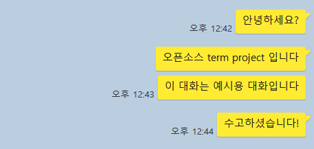
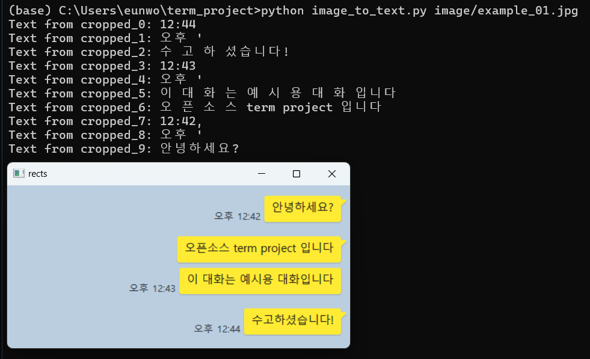

# Overview: Write code to convert text message images into text.

## **개요**
Develop an OCR (Optical Character Recognition) program to extract text messages from images.
The program utilizes the OpenCV, NumPy, and pytesseract libraries, and requires the installation and configuration of Tesseract OCR.

---
## Example images


---

## Required Libraries and Installation

### **1. OpenCV (cv2)**  
- **version**: opencv-python>=4.5.5  
- **설치 방법**:  
  ```bash
  pip install opencv-python
  pip install opencv-python-headless

### **2. Numpy (np)**  
- **version**: Recommended version is numpy>=1.21.0
- **설치 방법**:  
  ```bash
  pip install numpy

### **3. pytesseract**  
- **version**: Recommended version is pytesseract>=0.3.13
- **설치 방법**:  
  ```bash
  pip install pytesseract
  
tesseract 설치
https://github.com/UB-Mannheim/tesseract/wiki

### **Tesseract OCR**
- External software, not a Python package.
- **version**: Recommended version is Tesseract-OCR >=4.0
### Windows
Download and install Tesseract OCR from [Tesseract-OCR GitHub Releases](https://github.com/tesseract-ocr/tesseract/releases).
### Linux :
- **install**:  
  ```bash
  sudo apt update
  sudo apt install tesseract-ocr
### Mac :
- **install**:  
To install Tesseract OCR on macOS, use Homebrew:
  ```bash
  brew install tesseract
 
 Ensure the pytesseract.pytesseract.tesseract_cmd variable points to the correct Tesseract binary location (e.g., r'C:\Program Files\Tesseract-OCR\tesseract.exe' for Windows).
 
 ---
 ## Version
Python 3.12.7
pytesseract 0.3.13
tesseract v5.5.0.20241111
---
## How to Execute
- python image_to_text.py image/example01.jpg
---
## Reference

### code
- [Extracting Text with OpenCV on Stack Overflow](https://stackoverflow.com/questions/23506105/extracting-text-opencv/23565051#23565051)
- [blog: OpenCV와 Tesseract OCR 사용법](https://joon0zo.tistory.com/21)

### Understanding Image Preprocessing Methods
- [EasyOCR과 OpenCV를 이용한 광학식 문자 인식 기술 프로젝트](https://velog.io/@goinggoing/EasyOCR%EA%B3%BC-OpenCV%EB%A5%BC-%EC%9D%B4%EC%9A%A9%ED%95%9C-%EA%B4%91%ED%95%99%EC%8B%9D%EB%AC%B8%EC%9E%90%EC%9D%B8%EC%8B%9D%EA%B8%B0%EC%88%A0-%ED%94%84%EB%A1%9C%EC%A0%9D%ED%8A%B8)

### Limitations
Accuracy is not very high -> Could be improved by using a better OCR model.
